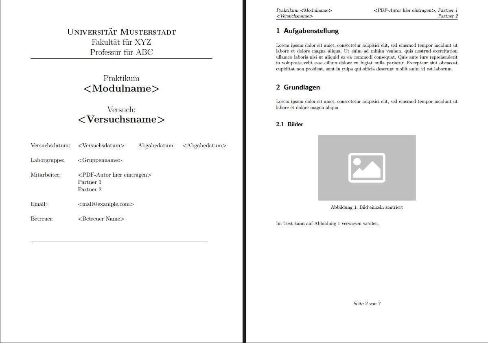

# Praktikum Versuchsprotokoll Vorlage Latex
Eine Vorlage für ein Versuchsprotokoll.

### Die PDF-Version der Beispieldatei kann [hier](Protokoll_Template/Protokoll.pdf) angesehen werden.

## Quellen/Inspiration für diese Vorlage
- http://www.martin-wolf.org/
- https://www.matthiaspospiech.de/latex/templates/protokolle/

Beispielinhalt:
- https://www.tv-bopfingen.de/beitrag-platzhalter-2/
- http://www.africau.edu/images/default/sample.pdf

  

This work by Dustin Brunner is licensed under <a rel="license" href="https://creativecommons.org/licenses/by/4.0">CC BY 4.0</a>

 Dieses Werk von Dustin Brunner ist lizenziert unter einer <a rel="license" href="http://creativecommons.org/licenses/by/4.0/">Creative Commons Namensnennung 4.0 International Lizenz</a>.